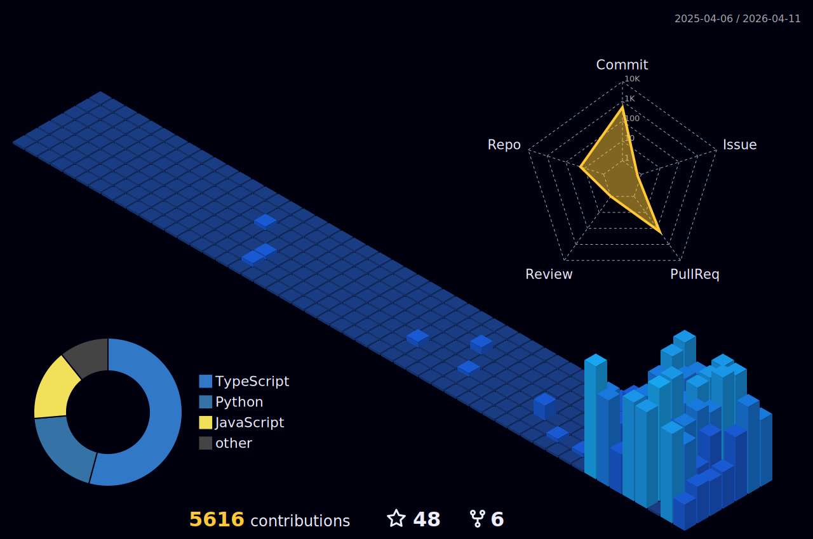

  

  

  

  
  

 

  

  
  
 
  <h3 align="center">
    <b>Architecting the Future at the Edge of Hardware & Software</b>
  </h3>
  

    I am a <b>Deep Tech Developer</b> and <b>AI & Robotics Innovator</b> with a relentless focus on bringing intelligent automation into the physical world. I specialize in harmonizing complex digital ecosystems with real-world, natural environments, transforming how we interact with technology through robotics, AI, and edge computing.
  

 

  
  
  

---

## 🚀 Corax CoLAB

  

  

    I am the Founder and CEO of <b></b>, an innovation lab dedicated to Intelligent Automation. We build the physical and digital infrastructure for next-generation automated systems, operating at the intersection of ag-tech, horticulture, and advanced robotics.
  

  

    
    
  

### 🌟 Featured Ventures

  
<b>🌱 GAP (Green Automated Process)</b>

   
  A decentralized IoT platform integrating state-of-the-art sensors and AI models. It actively monitors, analyzes, and optimizes resource flows in natural ecosystems.

  
<b>🕷️ GAPbot</b>

   
  Autonomous hexapod robots engineered to navigate, analyze, and perform complex tasks in unstructured and challenging terrains. GAPbot bridges the gap between software intelligence and physical execution.

  
<b>📈 Crypto MCP Server by Corax CoLAB</b>

   
  An innovative server solution tailored for real-time cryptocurrency integrations and MCP architectures. Explore the .

 

  

---

## 🛠️ Tech Stack & Arsenal

  

  

  

  
<b>🔍 Detailed Breakdown</b>

   

**Languages**

  
  
  
  
  

**AI & Machine Learning**

  
  
  
  

**Hardware, IoT & Robotics**

  
  
  
  
  
  

**Tools & DevOps**

  
  
  
  
  
  

**Concepts & Domains**

 
  
  
  
  

---

## 📊 Analytics & Impact

  

  
  

  
  

---

## 🐍 Activity Grid

  <picture>
    <source media="(prefers-color-scheme: dark)" srcset="github-contribution-grid-snake-dark.svg">
    <source media="(prefers-color-scheme: light)" srcset="github-contribution-grid-snake.svg">
    
  </picture>

  

---

<!-- START_SECTION:waka -->
<!-- END_SECTION:waka -->

---

## ⚡ Recent Pulses
<!--START_SECTION:activity-->
1. 🎉 Merged PR [#77](https://github.com/PelleNybe/CryptoPsCryptoFortuneTeller/pull/77) in [PelleNybe/CryptoPsCryptoFortuneTeller](https://github.com/PelleNybe/CryptoPsCryptoFortuneTeller)
2. 💪 Opened PR [#77](https://github.com/PelleNybe/CryptoPsCryptoFortuneTeller/pull/77) in [PelleNybe/CryptoPsCryptoFortuneTeller](https://github.com/PelleNybe/CryptoPsCryptoFortuneTeller)
3. 🎉 Merged PR [#32](https://github.com/PelleNybe/Crypto-MCP-Server---by-Corax-CoLAB/pull/32) in [PelleNybe/Crypto-MCP-Server---by-Corax-CoLAB](https://github.com/PelleNybe/Crypto-MCP-Server---by-Corax-CoLAB)
4. 💪 Opened PR [#32](https://github.com/PelleNybe/Crypto-MCP-Server---by-Corax-CoLAB/pull/32) in [PelleNybe/Crypto-MCP-Server---by-Corax-CoLAB](https://github.com/PelleNybe/Crypto-MCP-Server---by-Corax-CoLAB)
5. 🎉 Merged PR [#20](https://github.com/PelleNybe/pellenybe.github.io/pull/20) in [PelleNybe/pellenybe.github.io](https://github.com/PelleNybe/pellenybe.github.io)
<!--END_SECTION:activity-->

---

## 📰 Latest Insights from Corax CoLAB
<!-- BLOG-POST-LIST:START -->
- [Utvecklingen av robotik, AI och edge-teknik: Varför Corax CoLAB valde en hexapod](https://coraxcolab.com/sv/aktuellt/artiklar/utvecklingen-robotik-ai-edge-corax-colab-hexapod)
- [Självläkande Hexapoder &amp; Autonom Cyberfysisk Infrastruktur: Corax CoLABs Vision](https://coraxcolab.com/sv/aktuellt/artiklar/sjalvlakande-hexapoder-autonom-infrastruktur-corax-colab)
- [Introduktion till Modern Robotik: Från Molnet till Markens Kant](https://coraxcolab.com/sv/aktuellt/artiklar/Introduktion-till-Modern-Robotik-Fran-Molnet-till-Markens-Kant)
- [The Full-Stack of Matter – Ingenjörskonst för en Ostrukturerad Värld](https://coraxcolab.com/sv/aktuellt/artiklar/the-full-stack-of-matter-ingenjorskonst-ostrukturerad-varld)
- [Svärmens Logik – Decentraliserad Intelligens och Framtidens Arbetsstyrka](https://coraxcolab.com/sv/aktuellt/artiklar/svarmens-logik-decentraliserad-intelligens)
<!-- BLOG-POST-LIST:END -->

---

## 💖 Support & Collaborate

  

    If you find my projects helpful or interesting, please consider giving them a <b>star</b> ⭐, <b>fork</b> 🍴, or <b>watch</b> 👀! Your support is highly appreciated and helps drive future innovations.
  

  

    
    
    
  

   
  

    <b>💖 Support my work:</b>  
    
    
  

  

    Building the future of physical automation requires community. Feel free to <b>fork</b> 🍴 open-source repositories to experiment or contribute. Let's innovate together!
  

  

